# Pre-requisitos
1. [Minikube instalado](https://minikube.sigs.k8s.io/docs/start/?arch=%2Fmacos%2Farm64%2Fstable%2Fbinary+download)
2. [Podman instalado](https://podman.io/)
3. [cli istioctl instalado](https://istio.io/latest/docs/ops/diagnostic-tools/istioctl/)
4. [Argo cd cli](https://argo-cd.readthedocs.io/en/stable/cli_installation/)
5. [plugging Argo Rollouts instalado ](https://argo-rollouts.readthedocs.io/en/stable/installation/)
6. [Getting started Argo Rollout with istio](https://argo-rollouts.readthedocs.io/en/stable/getting-started/istio/)


# Instalación minikube

1. Eliminar instalación y configuracion de minikube anterior

```shell
minikube delete
```
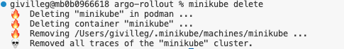

2. Instalar minikube con podman

```shell
minikube start --driver=podman --container-runtime=containerd --memory=3621 --cpus=2 --addons=metrics-server --addons=ingress
```

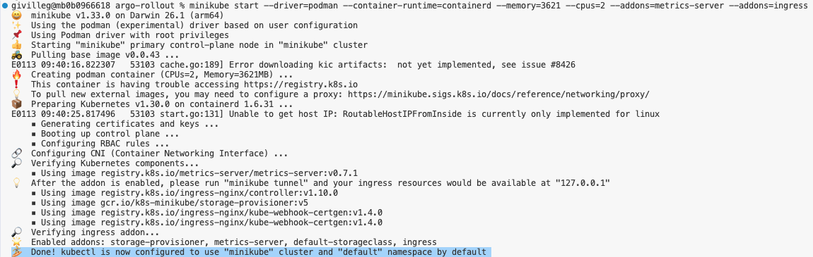

3. Chequear el status de minikube

```shell
minikube status
```
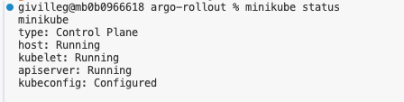

# Instalación istio

1. Instalación de istio con istioctl

```shell
istioctl install --set profile=demo -y
```
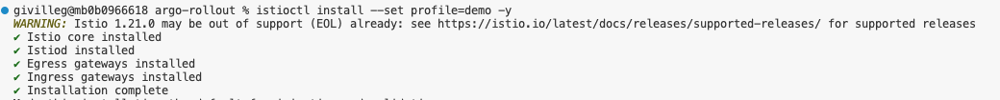

2. Habilitar istio en el namespace default

```shell
kubectl label namespace default istio-injection=enabled
```
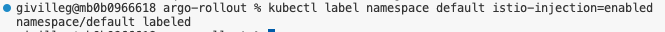


3. Chequear que esten en running los pods de istio
```shell
kubectl get po -n istio-system
```

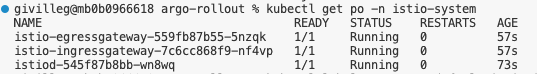

# Instalación Argo CD

1. Crear namespace para argo cd

```shell
kubectl create namespace argocd
```

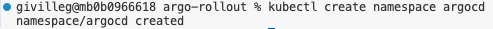

2. Install argocd en namespace argocd
```shell
kubectl apply -n argocd -f https://raw.githubusercontent.com/argoproj/argo-cd/stable/manifests/install.yaml
```
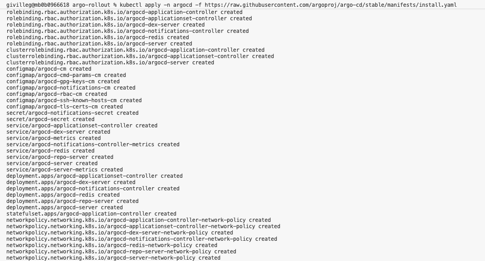

3. Esperar hasta que argocd este listo
   
```shell
kubectl wait --for=condition=available --timeout=300s deployment/argocd-server -n argocd
```


4. Porfordward de argocd. Hacerlo en una terminal aparte ya que queda bloqueada

```shell
kubectl port-forward svc/argocd-server -n argocd 8080:443
```

5. Obtener el password

```shell
kubectl -n argocd get secret argocd-initial-admin-secret -o jsonpath='{.data.password}' | base64 -d && echo
```
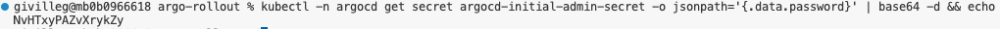

6. Acceder a la consola de argocd

https://localhost:8080

username: admin
password: El recuperado en el punto anterior

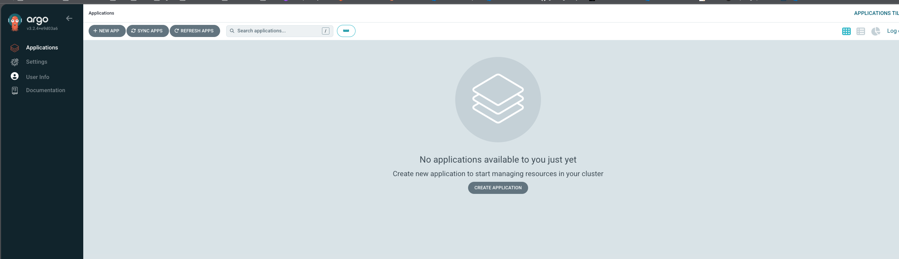

# Instalación Argo Rollout

1. Crear namespace para Argo Rollouts
   
```shell
kubectl create namespace argo-rollouts
```


2. Instalar Argo Rollouts en namespace argo-rollouts

```shell
kubectl apply -n argo-rollouts -f https://github.com/argoproj/argo-rollouts/releases/latest/download/install.yaml
```

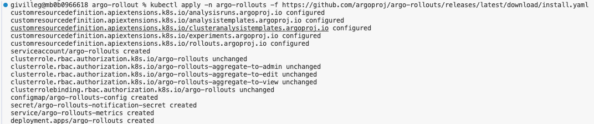

3. Esperar hasta que argo rollouts este listo

```shell
kubectl wait --for=condition=available --timeout=300s deployment/argo-rollouts -n argo-rollouts
```


4. Acceder al Argo Rollouts Dashboard

```shell
kubectl argo rollouts dashboard
```


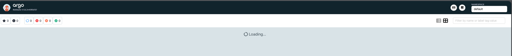

# Instalación de la aplicación

1. Aplicar los manifiestos

```shell
kubectl apply -f ./k8s/gateway.yaml
kubectl apply -f ./k8s/services.yaml
kubectl apply -f ./k8s/virtualsvc.yaml
kubectl apply -f ./k8s/rollout.yaml
```

2. Registrar la aplicación en ArgoCD
   
```shell
kubectl apply -f ./k8s/rollouts-demo-argocd.yaml
```

3. Verificar en el dashbpard la aplicacion

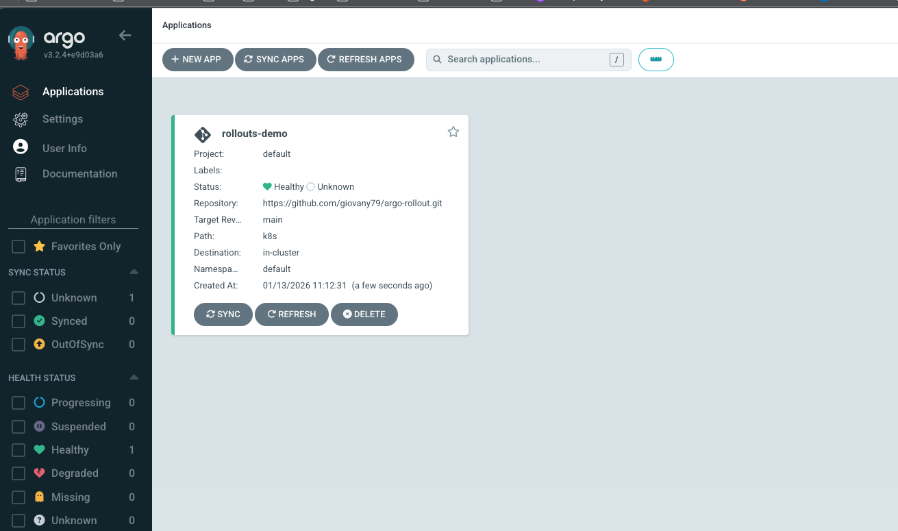


kubectl patch configmap argocd-cm -n argocd --type merge -p '{
  "data": {
    "repositories": "- url: https://github.com\n  insecure: true"
  }
}'